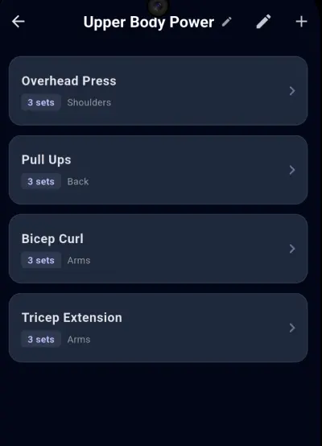

# 🏋️ Lift

<p align="center">
  <a href="https://apps.obtainium.imranr.dev/redirect?r=obtainium://app/%7B%22id%22%3A%22com.slayernominee.lift%22%2C%22url%22%3A%22https%3A%2F%2Fgithub.com%2Fslayernominee%2Flift%22%2C%22author%22%3A%22slayernominee%22%2C%22name%22%3A%22lift%22%2C%22preferredApkIndex%22%3A0%2C%22additionalSettings%22%3A%22%7B%5C%22includePrereleases%5C%22%3Afalse%2C%5C%22fallbackToOlderReleases%5C%22%3Atrue%2C%5C%22filterReleaseTitlesByRegEx%5C%22%3A%5C%22%5C%22%2C%5C%22filterReleaseNotesByRegEx%5C%22%3A%5C%22%5C%22%2C%5C%22verifyLatestTag%5C%22%3Afalse%2C%5C%22sortMethodChoice%5C%22%3A%5C%22date%5C%22%2C%5C%22useLatestAssetDateAsReleaseDate%5C%22%3Afalse%2C%5C%22releaseTitleAsVersion%5C%22%3Afalse%2C%5C%22trackOnly%5C%22%3Afalse%2C%5C%22versionExtractionRegEx%5C%22%3A%5C%22%5C%22%2C%5C%22matchGroupToUse%5C%22%3A%5C%22%5C%22%2C%5C%22versionDetection%5C%22%3Atrue%2C%5C%22releaseDateAsVersion%5C%22%3Afalse%2C%5C%22useVersionCodeAsOSVersion%5C%22%3Afalse%2C%5C%22apkFilterRegEx%5C%22%3A%5C%22%5C%22%2C%5C%22invertAPKFilter%5C%22%3Afalse%2C%5C%22autoApkFilterByArch%5C%22%3Atrue%2C%5C%22appName%5C%22%3A%5C%22%5C%22%2C%5C%22appAuthor%5C%22%3A%5C%22%5C%22%2C%5C%22shizukuPretendToBeGooglePlay%5C%22%3Afalse%2C%5C%22allowInsecure%5C%22%3Afalse%2C%5C%22exemptFromBackgroundUpdates%5C%22%3Afalse%2C%5C%22skipUpdateNotifications%5C%22%3Afalse%2C%5C%22about%5C%22%3A%5C%22%5C%22%2C%5C%22refreshBeforeDownload%5C%22%3Afalse%2C%5C%22includeZips%5C%22%3Afalse%2C%5C%22zippedApkFilterRegEx%5C%22%3A%5C%22%5C%22%7D%22%2C%22overrideSource%22%3Anull%7D">
  
  </a>
</p>

**Lift** is a modern, high-performance fitness tracker built with Flutter. It's designed for lifters who want a clean, distraction-free interface to manage their workouts, track their strength progress, and monitor body weight trends.

## Showcase

|  |  |  |
|  |  |  |

## ✨ Features

- **Workout Management**: Create custom workout routines, reorder exercises with drag-and-drop, and set target sets.
- **Exercise Pool**: A searchable database of exercises with support for custom additions.
- **Intelligent Tracking**:
  - Smart placeholders: Automatically see your weight/reps from your last session for that specific workout.
  - Simplified logging: Focus on your lift without toggling checkboxes.
- **Data Visualization**:
  - **Repetition History**: Scrollable timeline charts showing total volume progress.
  - **Weight Tracker**: Monitor body weight with a dedicated chart and date/time-specific logs.
  - **Interactive Timelines**: Swipe through history with range toggles (1W, 1M, 3M, All).
- **Modern UI**: A sleek, dark-themed interface built using Material 3 and an indigo-slate color palette.
- **100% Offline**: Works completely offline - no internet connection required for any features.
- **Local-First**: Fast performance and offline support using Hive NoSQL storage.

## 🛠️ Tech Stack

- **Framework**: [Flutter](https://flutter.dev)
- **State Management**: [Provider](https://pub.dev/packages/provider)
- **Database**: [Hive](https://pub.dev/packages/hive) (Local Persistence)
- **Charts**: [fl_chart](https://pub.dev/packages/fl_chart)
- **Icons**: Material Icons & Font Awesome

## 🔒 Privacy & Offline-First

**Lift is designed with your privacy as the top priority.**

### Completely Offline

- **No Internet Required**: The app works 100% offline. All features are available without an internet connection.
- **No Cloud Sync**: Your data never leaves your device. No account creation, no cloud servers, no data transmission.
- **Your Data, Your Device**: All your workout data, preferences, and settings are stored locally on your device.

### Privacy Commitment

- **No Data Collection**: We don't collect, share, or sell any of your data.
- **No Analytics**: No tracking or analytics services are used.
- **No Accounts**: Use the app immediately without creating an account or providing personal information.
- **Your Data Stays Private**: Since everything is stored locally, only you have access to your workout information.

For the complete privacy statement, see [docs/PRIVACY.md](docs/PRIVACY.md).

## 🚀 Getting Started

### Prerequisites

- Flutter SDK: `^3.10.4`
- Dart SDK: `^3.10.0`

### Installation

1. **Clone the repository**:

   ```bash
   git clone https://github.com/slayernominee/lift
   cd lift
   ```

2. **Install dependencies**:

   ```bash
   flutter pub get
   ```

3. **Generate Hive Adapters**:

   ```bash
   dart run build_runner build --delete-conflicting-outputs
   ```

4. **Run the app**:
   ```bash
   flutter run
   ```

---

Built for lifters ;P
