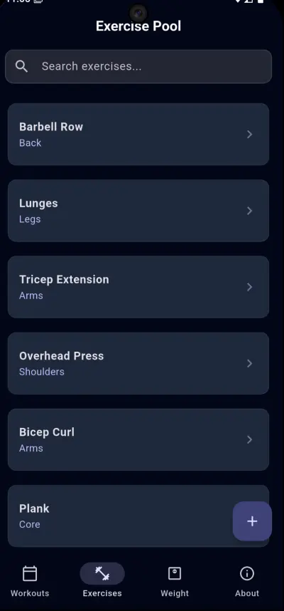

# 🏋️ Lift

**Lift** is a modern, high-performance fitness tracker built with Flutter. It's designed for lifters who want a clean, distraction-free interface to manage their workouts, track their strength progress, and monitor body weight trends.

## Showcase

|  |  |  |
|  |  |  |

## ✨ Features

- **Workout Management**: Create custom workout routines, reorder exercises with drag-and-drop, and set target sets.
- **Exercise Pool**: A searchable database of exercises with support for custom additions.
- **Intelligent Tracking**:
  - Smart placeholders: Automatically see your weight/reps from your last session for that specific workout.
  - Simplified logging: Focus on your lift without toggling checkboxes.
- **Data Visualization**:
  - **Repetition History**: Scrollable timeline charts showing total volume progress.
  - **Weight Tracker**: Monitor body weight with a dedicated chart and date/time-specific logs.
  - **Interactive Timelines**: Swipe through history with range toggles (1W, 1M, 3M, All).
- **Modern UI**: A sleek, dark-themed interface built using Material 3 and an indigo-slate color palette.
- **Local-First**: Fast performance and offline support using Hive NoSQL storage.

## 🛠️ Tech Stack

- **Framework**: [Flutter](https://flutter.dev)
- **State Management**: [Provider](https://pub.dev/packages/provider)
- **Database**: [Hive](https://pub.dev/packages/hive) (Local Persistence)
- **Charts**: [fl_chart](https://pub.dev/packages/fl_chart)
- **Icons**: Material Icons & Font Awesome

## 🚀 Getting Started

### Prerequisites

- Flutter SDK: `^3.10.4`
- Dart SDK: `^3.10.0`

### Installation

1. **Clone the repository**:

   ```bash
   git clone https://github.com/slayernominee/lift
   cd lift
   ```

2. **Install dependencies**:

   ```bash
   flutter pub get
   ```

3. **Generate Hive Adapters**:

   ```bash
   dart run build_runner build --delete-conflicting-outputs
   ```

4. **Run the app**:
   ```bash
   flutter run
   ```

---

Built for lifters ;P
